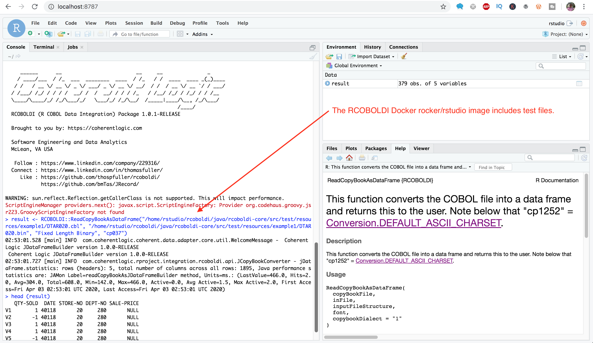

If you're looking to load COBOL data files into the R Project for Statistical Computing then you came to the right place.

In this video we will demonstrate the open-source R COBOL Data Integration package running in Docker.

The Dockerfile in this example is based on Rocker / RStudio and will be running locally on port 8787.

Step 1.) Build the image (this can take up to 20 minutes).

```
docker build -t rcoboldi/rocker-rstudio:1.0.1 https://raw.githubusercontent.com/thospfuller/rcoboldi/master/docker/rocker/rstudio/Dockerfile
[some image id]
```


Step 2.) Launch a container based on this image.

```
docker run -d -p 8787:8787 -e PASSWORD=password --name rstudio -i -t [some image id]
[some container id]
```

Step 3.) Browse to http://localhost:8787 and enter the username & password combination rstudio & password.

The next three steps appear in the video.

Steps 4-7.) From the R CLI execute:
```
# Step 4.)
library(RCOBOLDI)

# Step 5.)
RCOBOLDI::Initialize()

# Step 6.)
result <- RCOBOLDI::ReadCopyBookAsDataFrame("DTAR020.cbl", "DTAR020.bin", "Fixed Length Binary", "cp037")

# Step 7.)
head(result)
```


